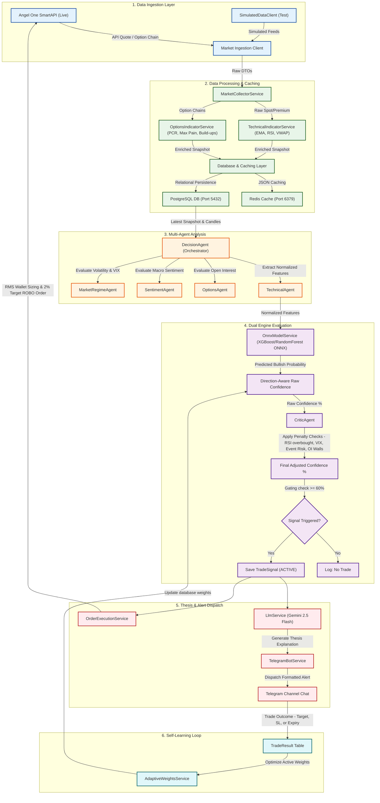

# Nifty Option Buying Signal Engine - Architecture Diagram

Below is the complete architectural workflow of the system, illustrating how live data is collected, parsed, analyzed by specialized agents, scored under a dual confidence/critic model, explained by Gemini AI, and dispatched to your Telegram channel.

